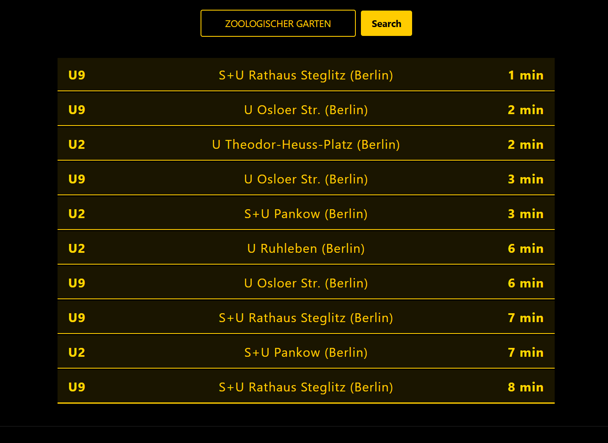

# BVG Live Line 🚇

Real-time U-Bahn arrival information for Berlin. Simple, fast, and mobile-friendly.



## Features

- 🚇 Real-time U-Bahn arrivals
- 🔍 Station name autocomplete
- 📱 Mobile-friendly design
- 🎨 BVG-themed interface

## Installation

1. Clone the repository:
   ```bash
   git clone https://github.com/eoksumm/BVGLiveLine.git
   cd BVGLiveLine
   ```

2. Install dependencies:
   ```bash
   pip install -r requirements.txt
   ```

3. Run the application:
   ```bash
   python main.py
   ```

4. Open browser: `http://localhost:5000`

## Tech Stack

- **Backend:** Python, Flask
- **Frontend:** HTML, CSS, JavaScript
- **API:** BVG Transport REST API

## License

MIT License